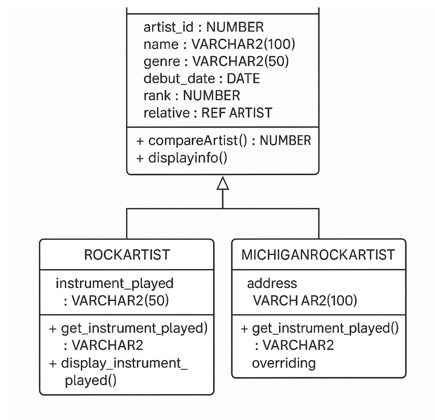

### Explanation of the SQL Code
The provided SQL script demonstrates various aspects of Oracle's object-oriented capabilities, including creating object types, tables of object types, and working with REF and DEREF for relationships. It also showcases inheritance with object types.

### Explanation of the Diagram:
#### Artist Class: 
Represents the base object type.
It lists its attributes (artist_id, name, genre, debut_date, rank) along with their data types and specified constraints (PK, NOT NULL, UNIQUE, >0).
#### The relative: 
REF Artist indicates a self-referencing relationship, where an Artist object can reference another Artist object.
Methods compareArtist() and displayInfo() are also included.
#### RockArtist Class: 
Represents the RockArtist object type.
The arrow with a solid line and a triangular arrowhead (<|--) indicates that RockArtist inherits from Artist.
It includes its own attribute instrument_played and methods get_instrument_played() and display_instrument_played(). The (FINAL) tag signifies that display_instrument_played() cannot be overridden.
####  MichiganRockArtist Class: 
Represents the MichiganRockArtist object type.
It inherits from RockArtist.
It adds the address attribute.

The (OVERRIDING) tag on get_instrument_played() indicates that this method overrides the one in RockArtist.
ArtistInfo Table: This is not an object type but a table that stores instances of the Artist object type.
"table of" indicates that ArtistInfo is a table designed to hold Artist objects.

The relationship ArtistInfo "1" -- "0..1" Artist : relative (REF) explicitly shows that an Artist object within the ArtistInfo table can have a relative attribute that points to another Artist object within the same table. The cardinality is 0..1 because the relative attribute can be null.
